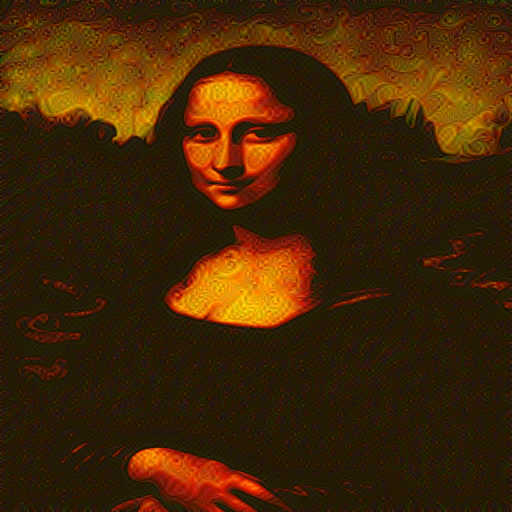

# Art Style Transfer Model

## Starting images

| Original                                      | Styled                                   |
| --------------------------------------------- | ---------------------------------------- |
|  |  |

## Results

| Iterations | Result after X iterations                                                         |
| ---------- | --------------------------------------------------------------------------------- |
| 20         |    |
| 400        |  |

There is a difference between the both images, albeit very small

## Goal when starting the project

I saw this image before I started, and wanted to mimic the results. I clearly failed, but that is most likely because I trained the model for waaaaay too little iterations

In the future, some day (I promise I won't forget), I will train this model again for a longer period, and add the results.