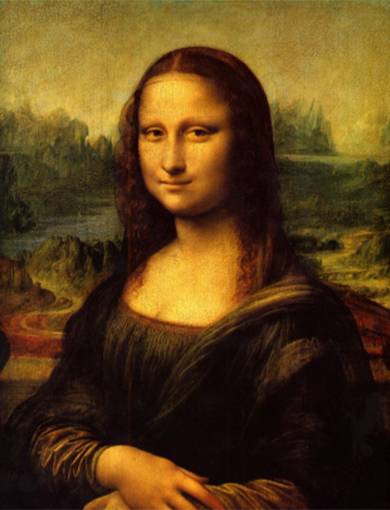

# Art Style Transfer Model

## Foreword

I totally forgot Tensorflow does not support GPU training on Windows by default. So the first three training sessions I was only using my CPU. For the 4000 and after iterations training sessions, I set up a WSL that **DID** have GPU training. And the training was of course way faster. I am stupid

## Starting images

| Original                                      | Styled                                   |
| --------------------------------------------- | ---------------------------------------- |
|  |  |

## Results

| Iterations | Result after X iterations                                                          |
| ---------- | ---------------------------------------------------------------------------------- |
| 20         |     |
| 400        |   |
| 2000       |  |
| 4000       |  |

There is a difference between the first two images, albeit very small. The third image (2000 iterations) looks way different, but still not close to the Styled image.

## Training stats

| Iterations | Training time (hh:mm:ss) | Training time (seconds) | Speed                                                                            |
| ---------- | ------------------------ | ----------------------- | -------------------------------------------------------------------------------- |
| 20         | 00:01:03                 | 63                      | 3.15 seconds per iteration                                                       |
| 400        | 00:20:36                 | 1236                    | 3.09 seconds per iteration                                                       |
| 2000       | 01:45:37                 | 6337                    | 3.16 seconds per iteration (running with several MS Edge tabs in the background) |
| 4000       | 00:07:29                 | 449                     | 0.112 seconds per iteration (I decided to use my brain, and train using my GPU)  |

## Goal when starting the project

I saw this image before I started, and wanted to mimic the results. I clearly failed, but that is most likely because I trained the model for waaaaay too little iterations

In the future, some day (I promise I won't forget), I will train this model again for a longer period, and add the results.

EDIT: I trained it for 2000 iterations the day after writing this ^
